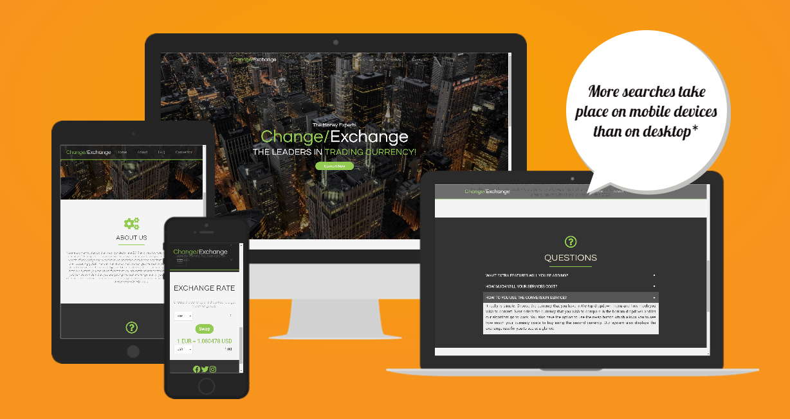
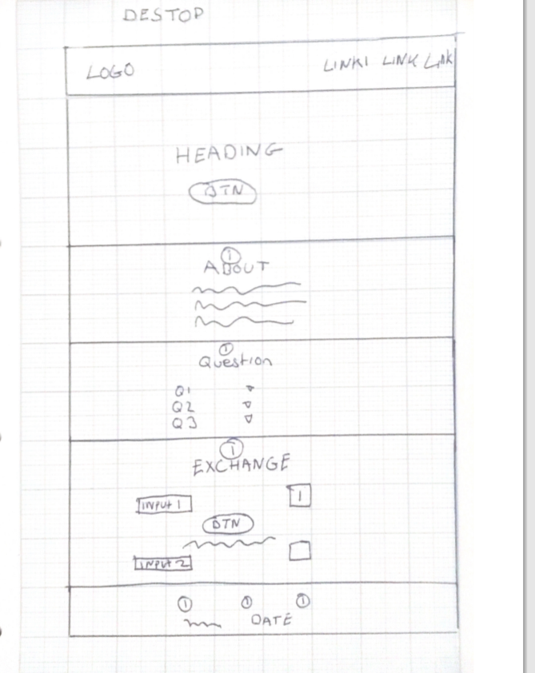
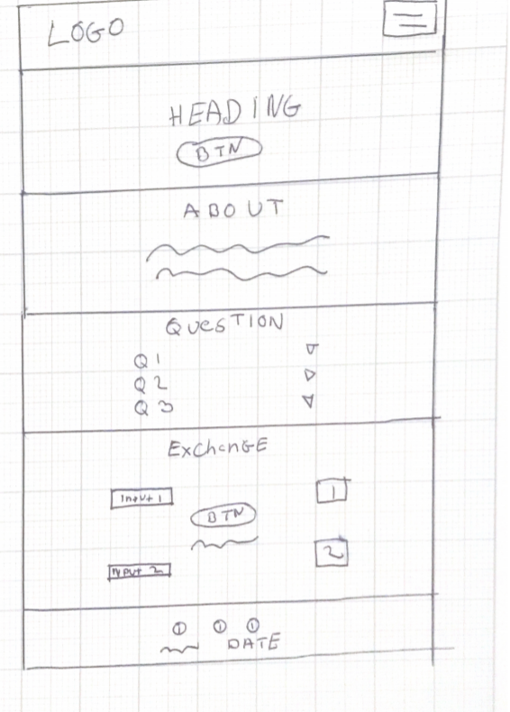

# changeExchange

## INTRO

ChangeExchange is a website created for a fictional financial company that has a focus on selling currency. The webstie provides a way for users to find out about the company along with the ability to compare the exchange rates of different currency from around the world. The site uses HTML, CSS, Bootstrap, JavaScript, +JQuery to acheive the owners goals.

## DEMO

A working demo version of the ChangeExchange site can be found at:
https://tod619.github.io/changeExchange/

## PROJECT DESCRIPTION + FEATURES

This project is a one page static site that contains six sections. The sites primary goal is to allow a user to interact with the information the site presents in a meanigful way to get information. This interaction is acheived with DOM manipulation which reveals or hides information from the user. Five out of the six sections contains some form of manipulation from JavaScript or JQuery.

1. Navigation Bar: A responsive navbar that sticks to the top of the screen. A smooth scroll function is added using JQuery which smoothly scrolls to links on the page. As the bar stays at the top of the screen additional classes are added or removed depending on the scroll position of the bar. This allows the navigation bar to remain visible even on the lighter sections of the site.

2. Showcase: The showcase section features a dynamic heading which updates the heading with different text through a dynamic typing effect. This effect is acheived using JavaScript.

3. About: This section contains some general information about the company along with a responsive icon that doesn't appear on smaller screens but will appear on larger ones.

4. FAQ: This section contains additional questions that a user might have about the company. Initially the answers are hidden from the users view and only the questions are visable. By clicking on the question the answer reveals itself through an animation. This hiding and revealing data is acheived using JavaScript.

5. Convertor: This section is where the user can check the exchange rates of different currencies. This is acheived by using the fetch api along with a third party api from https://api.exchangerate-api.com. The fetch api makes a call to this the exchangerate api which then returns a promise. We use JavaScript to convert this promise into a JSON object which we can use. With the information that we get form this site we can update the information in the DOM and these changes are presented to the user dynamically.

6. Footer: This is the footer section which contains links to ChangeExchnges social media accounts along with a copright and date. The information in the date section is dynamic and will change as the years roll on. This is acheived through JQuery which simply updates the text of a span with the current year.

## PROJECT STRATEGY

The main strategy that I had in mind when creating this site was to build a visually appealling site that would catch the users eye and that would be intuative to navigate around. I also wanted to create something that would be able to dynamically change sections on the site based on user actions. This was acheived using JavaScript + JQuery.

## PROJECT SCOPE

The scope of this project was to create a site for the ficitional start up comapny ChangeExchange that would allow a user to interact with their exchange rate algorithm which in turn would allow a user to see the different rates that different currencies were trading around the world.

## UI/UX

The layout of the site has been created to catch the eye of any potental customers. The site has a clean style with a serious colour scheme that has been created to present the information to the user in an easy to follow manner. The dark and light color scheme is broken up by the use of a bright lime green colour which adds a hint of freshness to the site. In keeping with the serious tone of the site sans-serif fonts were used for both the headings and the paragraphs as I felt that this was in keeping with the more business like tone for the site.

## USER STORIES

To help develop the site even more I created a few user stories from the company's + user perspectives.

As an owner of the site:

1. I would like an attractive and eye catching site.

2. I would like the site to contain information about the company and what we do.

3. I would like a site that works well on different devices so that users can have the same experience on a mobile or desktop.

As a user of the site:

1. I would like a site that is easy to navigate.

2. I would like to be able to interact with the product in a meaningful way.

3. I would like to be able to find up to date information on the exchange rate.

4. I would like the exchange rate convertor to be easy to use.

5. I would like to be able to learn the site once and for this experince to be usable on different devices.

## WIREFRAMES

Desktop Wireframe:

Mobile Wireframe:

To help visualize the site I created desktop + mobile wireframes which can be seen below.

## TECHNOLOGIES USED

1. HTML: used for structure of the site.

2. CSS: used to style the site

3. Bootstrap: used for reponsive features + navigation bar

4. Google Fonts: used to get a modern type set

5. Font Awesome: used to get icons

6. Coolor.io: used to help pick a colour scheme

7. JQuery: a JS library that has been used to update the DOM in certain places on the site.

8. JavaScript: Used to give some dynamic functionality on the site.

9. Exchange Rate api: used to get the exhange rate for the convertor on the site.

10. Github: used for version control

11. Github pages: used to host the site

12. VsCode: text editor that was used to develop the site.

## TESTING

Testing was carried out on the HTML + CSS using the W3 schools validators. The pages were loaded in directly to the system and there were no errors found in either file. I didn't upload via linking the site to these validators as the last time I tried doing this the site found errors because I was using Bootstrap and the system had a problem understanding the css variables that are used throughout Bootstrap.

For responsivness I checked a website called am I responvie. I also checked how the site looked on a variety of devices and browsers. The devices that I checked the site on were:

1. 15 inch HP Laptop

2. 13 inch Macbook pro

3. 21 inch desktop PC

4. Samsung galaxy phone

5. Iphone XS

6. Iphone 7

The site looked great on all these devices and didn't seem to show any problems.

The browsers I used for testing are as follows:

1. Google Chrome

2. Firefox

3. Safari

4. Microsoft Edge

The site worked great in all the browsers that I tested it in. This time when testing I decided not to test on Microsoft Internet Explorer for a number of reasons. Firstly Microsoft no longer support IE and have instead moved onto the Edge browser. Also the user numbers on IE are very small. Finally I have used both flex box + Es6 JavaScript which the IE browser has problems handling.

## DEPLOYMENT

This site is deployed using a feature of Github known as Github Pages. To make your site go live on the internet you need to follow the following steps:

1.Select the repository that you wish to make live.

2. Make sure that the home page is called index.html

3. At the top of the page click on the settings tab.

4. Once in the settings section scroll down the page untill you get to a section called github pages.

5. Where the option exits to select a branch to deploy change the option from none to master branch.

6. If you have followed these steps correctly the page should reload.

7. Scroll back down to the github pages section and you should see a message that reads something like this: your site is ready to be deployed at username.github.io/example

8. Wait for a few minutes and refresh the page and the if successfully the message should now read: Your site is published at ...

To create a local copy of the project you can select the repository and just above the readme file you will see a button that gives you the option to download or clone the file.

## FUTURE FEATURES

Through some bad planning on my part I did not get the chance to develop this project as much as I would have liked to. In the future I would like to add a review section that would let users read different reviews of the product. This would have been created using Javascript and it would allow a user to flip through different reviews
I would also have liked to go more in depth with the exchange rate api and created different graphs which would show the fluctuations in the market which in turn would have been more visually impactful for the user.

## REFERENCES

images were taken from https://www.pexels.com/

icons were sourced from https://fontawesome.com/

typing effect was acheived by following this tutorial: https://youtu.be/POX3dT-pB4E

FAQ section was built with help from the following book:
SAM's Teach Yourself Web Publishing. Chapter 19 Hiding + Showing Content pages 538 - 550.

Convertor section was built with the help of documentation found here: https://www.exchangerate-api.com/docs/free-exchange-rate-api and by following a tutorial found: https://www.udemy.com/course/web-projects-with-vanilla-javascript
